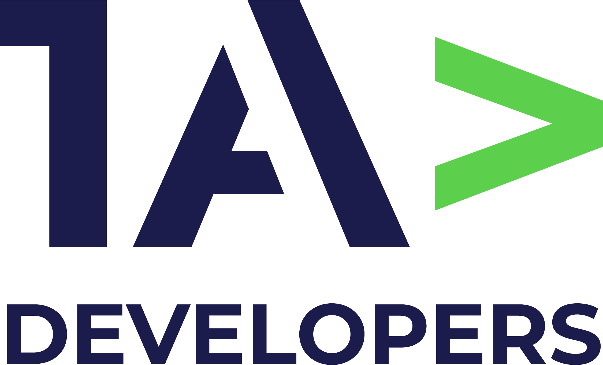

# Titulo 1ADeveloper

 

# Descripción:

Desarrollar un sitio web tipo profesional utilizando WordPress, cumpliendo con todas las consignas del proyecto.

Hacer una Startup que ofrece servicio de diseño web para todo tipo de emprendimientos que les permitan establecer una presencia digital sólida, aumentar su visibilidad en el mercado y alcanzar sus metas de negocio. 

# Instalación y Uso:

Instalar Wordpress en local con Xampp
Creación de Base de Datos
Configuración de titulo del sitio "1ADevelopers"
Crear usuario administrador con una contraseña segura

# Integrantes

* 👨🏽‍💻**Carlos Balbastro** - [Developer] - https://github.com/CarlosEduardoBalbastro
* 👨🏽‍💻**Dario Bosque** - [Developer] - https://github.com/dariodev18
* 👨🏽‍💻**Eric Heredia** - [Developer] - https://github.com/Heredia-Eric
* 👨🏽‍💻**Maximino Moyano** - [Developer] - https://github.com/MaxgelMax
* 👩🏽‍💻**Kiara Fernandez** - [Developer] - https://github.com/kiarafernandez756
* 👩🏽‍💻**Tiago Javier Nievas** - [Developer] - https://github.com/TiagonievasGH